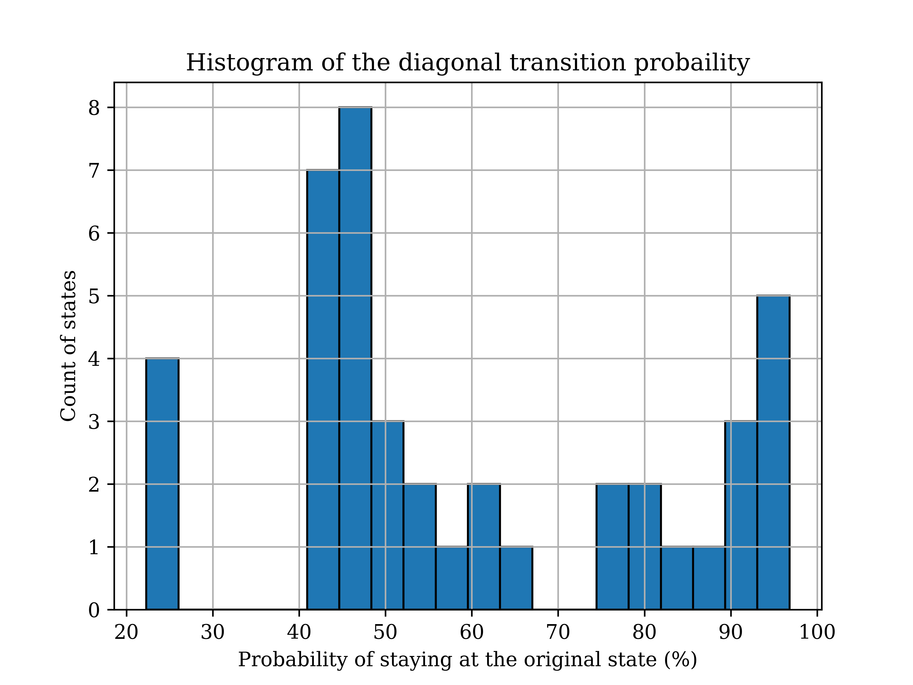

REMD_analysis
==============================
[//]: # (Badges)
[](https://travis-ci.com/REPLACE_WITH_OWNER_ACCOUNT/REMD_analysis)
[](https://ci.appveyor.com/project/REPLACE_WITH_OWNER_ACCOUNT/REMD_analysis/branch/master)
[](https://codecov.io/gh/REPLACE_WITH_OWNER_ACCOUNT/REMD_analysis/branch/master)

## Description
`REMD_analysis` is a Python package of data analysis tools for replica exchange molecular dynamics (REMD) simulations.

## Installation and Testing
All the Python scripts in this package are written in Python 3. Currently the package can be installed by following the commands below:
```
git clone https://github.com/wehs7661/REMD_analysis.git
cd REMD_analysis
pip install -e .
```
To perform the unit tests and functional tests (still underdevelopment) of this package, run:
```
python test_REMD_analysis.py    ; unit tests
python test_REMD_analysis.sh    ; functional tests
```

## Usage

### 1. `HREX_prep.sh` and `REMD_state_extract.py`: Prepartion of simulation input files
To run a REMD simulation, each replica requires one `.gro` file, starting with a different thermodynamic state specified in the `.mdp` file. (For example, the parameter `init-lambda-state` in the `.mdp` file for replica X is specified as X.) The `.gro` file for different replicas could be either the same or different. While the former is easier to set up, different `.gro` file for different replicas correspond to shorter correlation times. 

`HREX_prep.sh` is a shell script which provides a simple way to prepare simulations input files (such as `.mdp` and `.tpr` files for each replica) for Hamiltonian replica exchange simulations given the common `.gro` (either the same or different `.gro` files for each replica), `.top`, `.ndx` files and a template `.mdp file`. It also submits jobs to Summit or Bridges (user-defined). By running the command `bash HREMD_prep.sh`, the following promopts will be invoked for the user to specify relevant paramters:
```
This shell script prepares all the files needed to run a Hamiltonian replica exchange including .mdp files and .tpr files, given the common .gro file and a template .mdp file. A job submission script will also be generated.
Please input the name of the job: 
Please input the prefix of the file names: 
Please input the number of replicas: 
Please input the number of requested nodes: 
Please input the simulation time (in hour): 
Will the job be submitted to Summit or Bridges?
Are the configurations for different replicas the same? (yes/no)
```
For the last question, the script will only work if the initial configurations were prepared by `REMD_conf_prep.py`. Given the `.log` file and the corresponding `.tpr` file and `.xtc` file (or `.trr` file) of an expanded ensemble (EXE) simulation, and the `.mdp` file of the REMD simulation to run, `REMD_conf_prep.py` is able to extract configurations at different thermodyanmic states which can serve as the initial configurations of a REMD simulation, even if the number of states of the EXE and REMD simulations are different. For example, one can prepare the `.gro` files for a REMD simulation of 63 states given the simulation output files of an expanded ensemble simulation of 56 states by simply using the command `REMD_conf_extract.py`. (The code should be able to identify the files needed for the preparation. Specify the flasg if this is not the case.) The `STDOUT` of `REMD_conf_extract.py` should be like:
```
EXE simulation output files from which the configurations will be extracted:
PLCpep7.log, PLCpep7.tpr, and PLCpep7.xtc.
The .mdp file for the REMD simulation is : PLCpep7_HREX_template.mdp

Initializing the preparation of the .gro files ...
Identifying the time frames from which the configurations will be extracted ...
Start extracting configurations from the trajectory of the provided EXE simulation ...
```


Note: The script for preparing temperature replica exchange simulations are currently under development.

### 2. `REMD_analysis.py`: Visualization of transition/overlap matrices and state-time plot 

- The main program of this package, `REMD_anaysis.py`, is able to analyze the log files from a replica exchange simulation and perform the following tasks:

  - Plot the exploration of states as a function of time for each replica.
  - Visualize the transition matrix between differen replicas as a heat map, no matter the simulation reaches the time frame specified in the `mdp` or not.
  - **(Under development)** Given the `*dhdl.xvg` files from the simulation, this script is also able to perform free energy calculations using Multistate Bennett Acceptance Ratio ([MBAR](https://github.com/choderalab/pymbar)). For the documentation of `pymbar`, which is the implementation of MBAR, replease refer to [Dr. Chodera's GitHub repository](https://pymbar.readthedocs.io/en/master/).
  - **(Under development)** Similarly, with `*dhdl.xvg` files, the script is able to visualize the overlap matrix between different thermodynamic states.

 - To check the required inputs, outpus and the description of the code, run `REMD_analysis -h`.

 - Ideally, the code is able to find the `log` file(s) to be analyzed and identify the common prefix of the simulation files without any flags specified. Therefore, to run the program, simply run `REMD_anlysis`.  
 - As an example, three `.log` files are provided in the folder `REMD_analysis/examples`. The files `PLCpep7.part0002.log` and `PLCpep7.part0003.log` were generated in the extended simulations using the `-noappend` flag. As a result, three figures as shown below can be generated by running `REMD_analysis` upon these example files.
   - Exploration of states as a function of time ($r$: probability of staying at the original state)
    <p align="center">
     <br/>
    </p>

   - Visuazliation of the transition matrix
    <p align="center">
     <br/>
    </p>

    - Histogram of the diagonal transition probability 
    <p align="center">
     <br/>
    </p>

- Also, the `STDOUT` of the command above would be:
 ```
Data analysis of the file(s): PLCpep7.log, PLCpep7.part0002.log, and PLCpep7.part0003.log
=========================================================================================
Analyzing the log file ...
Simulation length: 19.0522 ns (95261 exchanges occured.)

Plotting the exploration of states as a function of time ...
The state time plot, state_time_PLCpep7.png, has been geneated.

Plotting the transition matrix as a heat map ...
The heat map of the transition matrix, transition_matrix_PLCpep7.png, has been generated.

Plotting the histogram of the diagonal transition probability ...
The histogram of the diagonal transition probability, hist_diag_PLCpep7.png, has been generated.

Total time elasped: 35.8121063709259 seconds.
 ```


## External Links
To get more realized about the theory and the implmentation of replica exchange simulation, we recommend the following materials:

- Tutorials by GROMACS on the implementation of REMD
  - [Tutorial 1 (REMD)](http://www.gromacs.org/Documentation/Tutorials/GROMACS_USA_Workshop_and_Conference_2013/An_introduction_to_replica_exchange_simulations%3A_Mark_Abraham%2C_Session_1B)
  - [Tutorial 2 (An introduction to replica exchange simulations: Mark Abraham, Session 1B)](http://www.gromacs.org/Documentation/How-tos/REMD)
- Literature (provided in the folder `REMD_analysis/papers`)
  - Temperature replica exchange
    - [Parallel tempering: Theory, applications, and new perspectives](http://doi.org/10.1039/B509983H)
  - Hamiltonian replica exchange
    - [A novel Hamiltonian replica exchange MD protocol to enhance protein conformational space sampling](http://doi.org/10.1021/ct050250b)
    - [Free energy perturbation Hamiltonian replica-exchange molecular dynamics (FEP/H-REMD) for absolute ligand binding free energy calculations](http://doi.org/10.1021/ct1001768)
    - [Hamiltonian replica exchange molecular dynamics using soft-core interactions](https://doi.org/10.1073/pnas.0409005102)
  - Optimization of replica exchange simulations
    - [Exchange often and properly in replica exchange molecular dynamics](https://doi.org/10.1073/pnas.0409005102)
    - [A temperature predictor for parallel tempering simulations](https://doi.org/10.1039/B716554D)
    - [Minimizing thermodynamic length to select intermediate states for free-energy calculations and replica-exchange simulations](https://doi.org/10.1103/PhysRevE.80.046705)
    - [Optimal allocation of replicas in parallel tempering simulations](https://doi.org/10.1063/1.1831273)
    - [On-line Optimization of Hamiltonian Replica Exchange Simulations](https://doi.org/10.1101/228262)
    - [Optimization of Umbrella Sampling Replica Exchange Molecular Dynamics by Replica Positioning](https://doi.org/10.1021/ct400366h)
  - Assessment of replica exchange simulations
    - [Strength and weakness of parallel tempering](https://arxiv.org/abs/0908.0012)
    - [Convergence and sampling efficiency in replica exchange simulations of peptide folding in explicit solvent](https://doi.org/10.1063/1.2404954)
  - Applications of replica exchange simulations
    - [Ensemble-Based Replica Exchange Alchemical Free Energy Methods: The effect of Protein Mutations on Inhibotor Binding](https://doi.org/10.1021/acs.jctc.8b01118)
    - [Efficient Sampling and Characterization of Free Energy Landscapes of Ion-Peptide Systems](https://doi.org/10.1021/acs.jctc.8b00560)
  - Variations of replica exchange molecular dynamics
    - [Enhanced Conformational Sampling Using Replica Exchange with Collective-Variable Tempering](https://doi.org/10.1021/ct5009087)
    - [Multidimensional replica-exchange method for free-energy calculations](https://doi.org/10.1063/1.1308516)
    - [Replica-exchange multicanonical algorithm and multicanonical replica-exchange method for simulating systems with rough-energy landscape](https://doi.org/10.1016/S0009-2614(00)00999-4)
    - [Adaptive Biasing Combined with Hamiltonian Replica Exchange to Improve Umbrella Sampling Free Energy Simulations](https://doi.org/10.1021/ct400689h)
   
## Copyright

Copyright (c) 2019, Wei-Tse (wehs7661@colorado.edu)


## Acknowledgements
 
Project based on the 
[Computational Molecular Science Python Cookiecutter](https://github.com/molssi/cookiecutter-cms) version 1.1.
